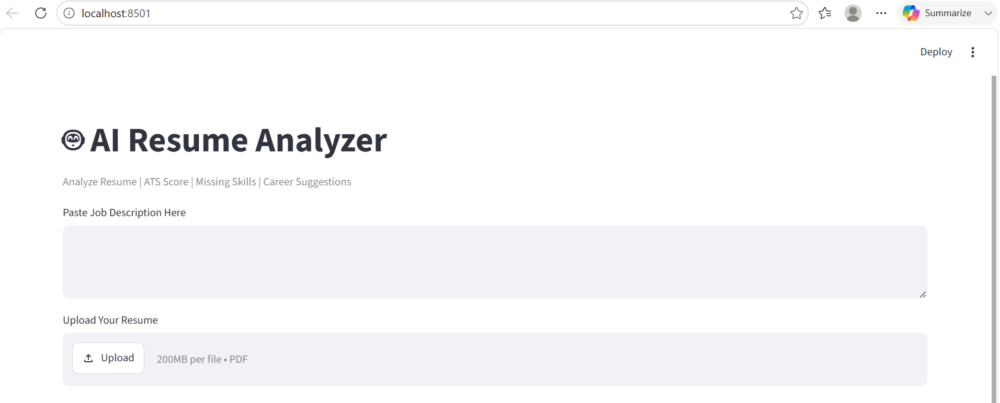
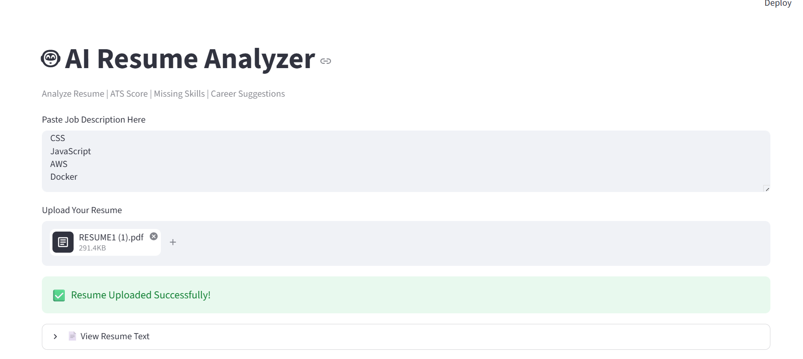
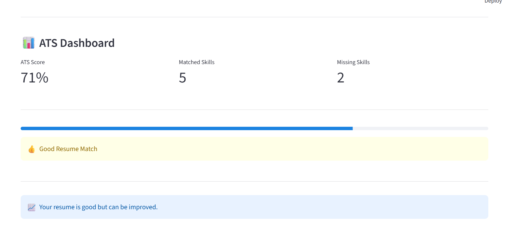
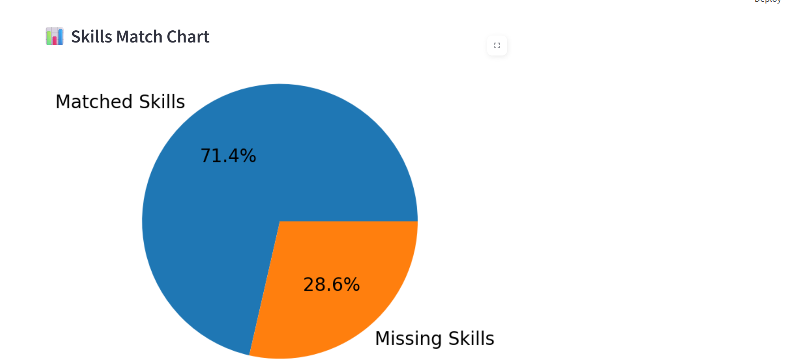
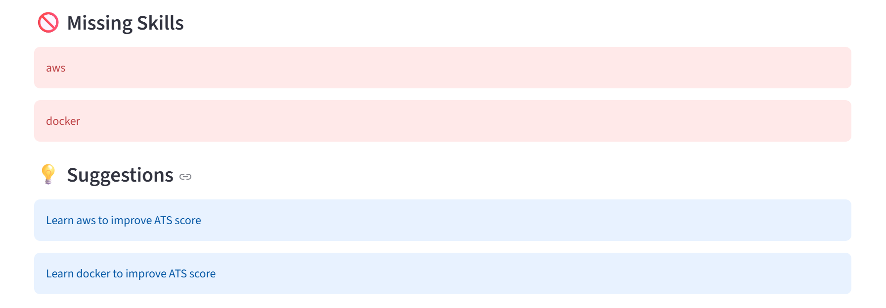
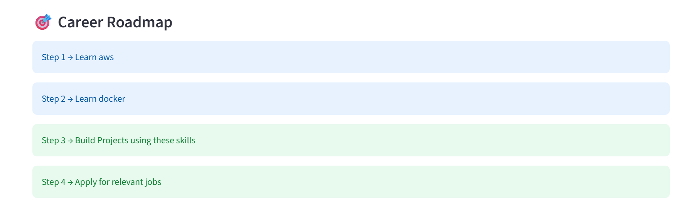
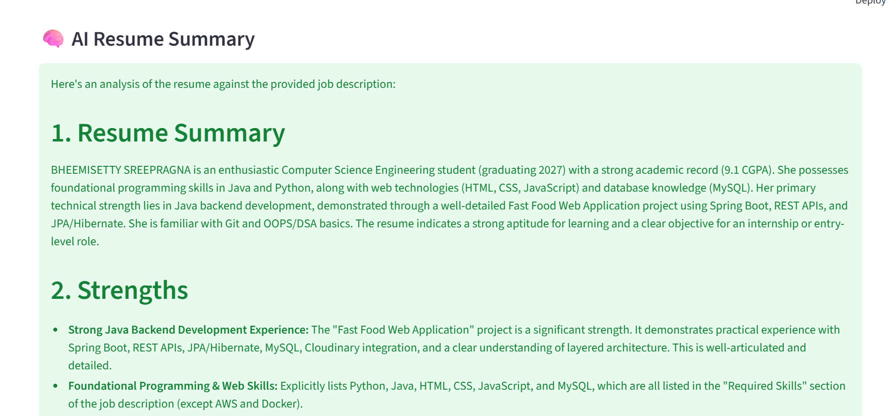
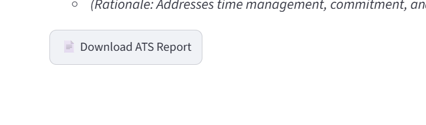

# 🤖 AI Resume Analyzer

An AI-powered Resume Analyzer built using Streamlit, Python, and Google Gemini AI that helps job seekers evaluate their resumes against a Job Description (JD), improve ATS compatibility, and receive AI-generated career guidance.

## 🚀 Live Demo

Add your Streamlit deployment link here:

```text
https://your-app-name.streamlit.app
```

## ✨ Features

* 📄 Upload Resume PDF
* 🔍 Extract Resume Text Automatically
* 📑 Resume Section Detection
* 🎯 ATS Score Calculation
* ✅ Matched Skills Analysis
* ❌ Missing Skills Detection
* 📊 Skills Match Pie Chart
* ⭐ Resume Rating System
* 💡 Personalized Improvement Suggestions
* 🎯 Career Roadmap Generation
* 💪 Resume Strength Analysis
* ⚠️ Weakness Detection
* 🤖 Recommended Job Roles
* 🧠 AI Resume Summary using Gemini AI
* 📄 Download ATS Report as PDF

## 🛠️ Technologies Used

* Python
* Streamlit
* Google Gemini AI
* PDFPlumber
* Matplotlib
* ReportLab
* Regular Expressions (Regex)

## 📂 Project Structure

```text
AI_Resume_Analyzer/

├── .streamlit/
│   └── secrets.toml

├── screenshots/
│   ├── home.png
│   ├── resume_upload.png
│   ├── ats_dashboard.png
│   ├── skills_chart.png
│   ├── suggestions.png
│   ├── career_roadmap.png
│   ├── ai_summary.png
│   └── pdf_report.png

├── app.py
├── requirements.txt
├── README.md
└── .gitignore
```

## 📸 Screenshots

### Home Page



### Resume Upload



### ATS Dashboard



### Skills Match Chart



### Suggestions



### Career Roadmap



### AI Resume Summary



### PDF Report



## ▶️ Run Locally

Clone the repository:

```bash
git clone https://github.com/Sreepragna23/AI-Resume-Analyzer.git
```

Navigate to the project folder:

```bash
cd AI-Resume-Analyzer
```

Install dependencies:

```bash
pip install -r requirements.txt
```

Create:

```text
.streamlit/secrets.toml
```

Add:

```toml
GEMINI_API_KEY="YOUR_API_KEY"
```

Run the application:

```bash
streamlit run app.py
```

## 📊 Output

* ATS Score
* Resume Rating
* Matched Skills
* Missing Skills
* Skills Match Visualization
* Career Suggestions
* Career Roadmap
* AI Resume Summary
* Recommended Roles
* PDF Report Generation

## 👩‍💻 Author

**Sreepragna B**

GitHub:
https://github.com/Sreepragna23
